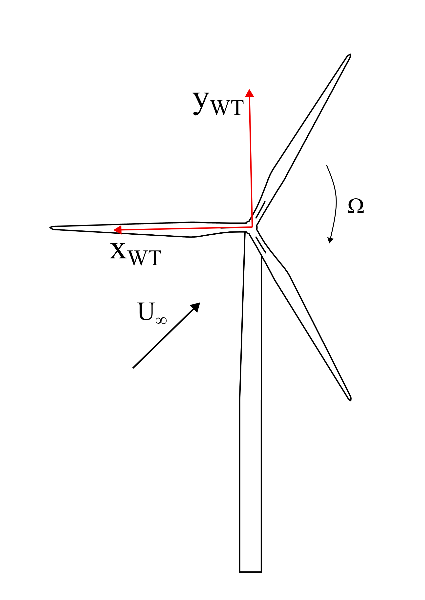
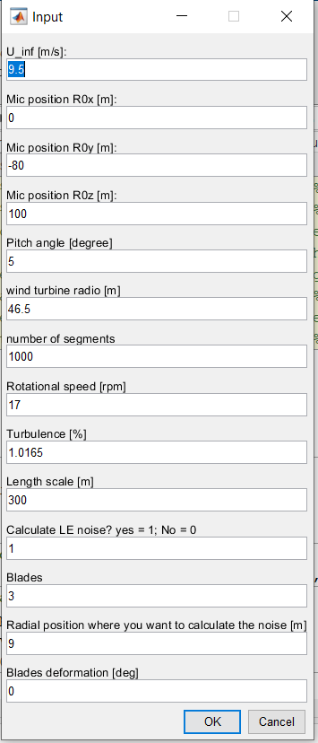
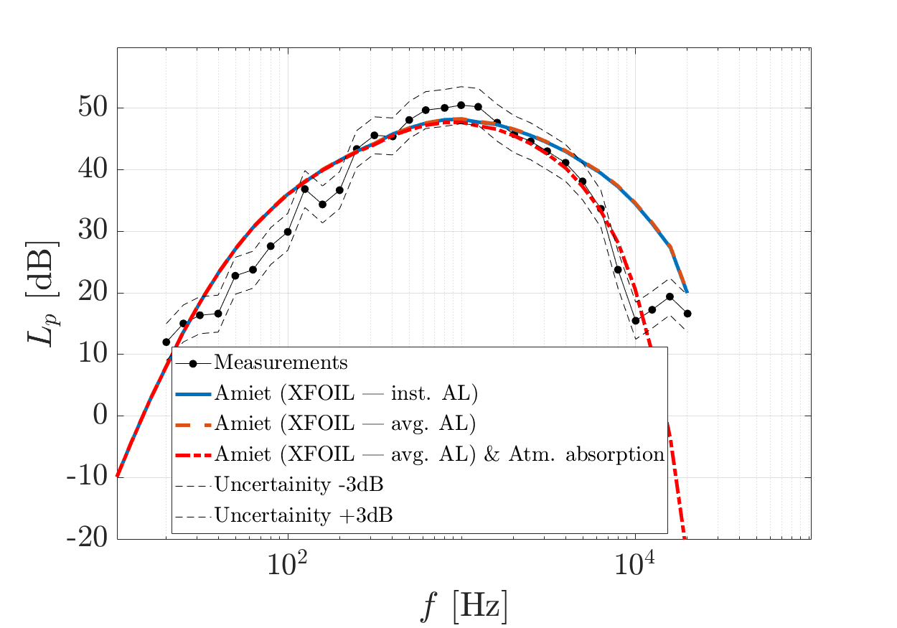

# Fast turn-around method for horizonal axis wind turbines

## Description:

This code predicts the wind turbine noise power spectral density of the far-field noise of a wind turbine over one rotation at a location provided by the user, considering as the only noise sources the leading- and trailing-edge noise. Leading and trailing-edge noise are calculated using Amiet's theory [1,2]. The code is linked with XFOIL that is used to obtain the aerodynamic properties of the airfoil. Therefore, this code is considered as a fast turn-around method to predict the wind turbine noise. The need inputs for predicting the wind turbine noise are: (i) operational conditions and obvserver location; (ii) the discretization of the blade geometry (chord, twist, and airfoil); (iii) aerodynamic analysis of the wind turbine, i.e., angle of attack and apparent velocity distribution along the blade. This can be averaged over several rotations or instant at each azimuth location. The methods and inputs' formart will be discussed in this readme file. 

## What is needed to run the code

This code is ready to use in a matlab for windows, specifically for the 2019 version. For running the code in linux or other operational systems, changes in the scripts migth be conducted accordinly, mainly in the script: ``XFOIL_new_airfoil.m``. 

The executable of XFOIL is in the folder. The user does not need to install anything regarding this. 

## Wind turbine noise prediction method:

The noise produced by the wind turbine is calculated using strip theory, where the blade is divided into $n$ segments with aspect ratio great or equal to 3 to keep the assumption of large aspect ratio needed for Amiet's theory. The blade is divided into segments that are more refined close to the blade tip. An initial sinusoidal distribution is conducted assuming a semicircle of radius the wind turbine radius with real airfoils. The inner part of the blades that consist of cylinders is neglected. For each segment, the geometric characteristics of the wind turbine, i.e., $c$, and $\phi$, are interpolated linearly to obtain the values at the center of the section where $R_a$ is located. As the airfoil might change along the segment, the airfoil at the beginning of the section is assumed. At the end of this process, it is verified that the aspect ratio $d/c$ is larger than 3; otherwise, the segment is extended until the next point of the initial sinusoidal distribution. When the final locations of $R_a$ are obtained, the values from the actuator line (AL) simulations are obtained for each position, also interpolating linearly the results to the center of the segment. With these interpolations, the inputs for XFOIL simulations of each segment are obtained. For each wind turbine, a convergence of the divisions in the noise prediction is conducted using as input the mean results of the AL over one rotation.

For each segment, the leading- and trailing-edge noise is calculated as uncorrelated noise sources using Amiet's method for both noise sources for 2D airfoils. The effect of the rotation is incorporated using the resultant tangential velocity for each segment obtained from the aeordynamic simulations. If the user does not have this information it can be conputed as the vectorial sum of the inflow velocity and the rotational speed at each segment. Afterward, the total noise of the blade is calculated as the sum of the total noise of each segment. This procedure is done for each angular position $\Psi$. 

The coordinate system in the fixed reference frame of the wind turbine is $Z_\mathrm{WT}$ is perpendicular to the rotor plane, positive in the downwind direction, and $Y_\mathrm{WT}$ is the vertical direction, positive upwards. $\Psi=0$ is aligned with $X_\mathrm{WT}$-axis. The origin of the coordinate system is the wind turbine hub, as shown in this figure:

For the noise prediction of each segment, the location of the observer is transformed in the coordinates of Amiet's theory by: 

1. Rotating the observer position in the z axis by the azimuth angle ($\Psi$)
2. Translating the new observer position in the x axis to the center of the section
3. Rotating the new observer position in the y axis by an angle that is the sum of the pitch angle (defined as operational condition) plus the twist angle of each section. 

Furthermore, the relative motion of the segment is considered by adding a Doppler effect factor to the noise calculated at the emited frequency. The strip theory is implemented following the approach of [3].

Leading-edge (LE) and trailing-edge (TE) noise are predicted using Amiet's theory. The theory assumes a flat plate geometry with an infinitely small thickness, a stationary observer, and a uniform free-stream condition along the span. Each noise source considers the sub and supercritical gusts and the scatter and back-scattering effects. For this, the airfoil response function of each noise source is modeled as a funcion of the frequency and calculated as the sum of the scatter and back scattering effects as shown in [4].

### Leading-edge noise:
The main input in Amiet's theory to calculate the leading-edge noise is the velocity spectrum, which can be calucalted based on the velocity fluctuations and integral length scale, which are user inputs. 

There are three models implemented to calculate the turbulence spectrum:

1. von Kárman model [5]
2. Liepmann model [6]
3. Turbulence distortion model [7]. 

To correct the dissipation range of the spectrum there are some options:

1. No corrections
2. Roger Moreau [8]
3. dos Santos, Botero-bolivar, et al. [9]

### Trailing-edge noise

The main input in Amiet's theory to calculate the leading-edge noise is the wall-pressure spectrum, which can be calucalted based boundary layer parameters that are taken from XFOIL. 

The models implemented to calculate the wall-pressure spectrum are:
1. Amiet's model [1]
2. Goodys's model [10]
3. Lee's model [11]
4. Kammrruzamann model [12]
5. TNO-Blame model [13].

## To run the code for the aerodynamic inputs averaged over one rotation:
The main script to run is ``Main_strip_theory.m``. This will open a dialog box:

where:
* ``U_inf`` is the inflow velocity in m/s
* ``Mic position R0x `` is the coordinate in the x-axis in [m]
* ``Mic position R0y `` is the coordinate in the y-axis, i.e., in the vertical direction, positive upwards in [m]
* ``Mic position R0z `` is the coordinate in the z-axis, i.e., in the downstream direction, in [m]

**the orygen of the coordinate system is on the center of the hub. Therefore, for a wind turbine of heigth 80 m, a microphone located at 100 m downstream on the ground would be: `` Mic position R0x = 0; Mic position R0z = -80, Mic position R0z = 100``**

* ``pitch angle`` is the pitch angle of the wind turbine in degrees
* ``wind turbine radio`` is the radio of the wind turbine (from the hub) in m
* ``number of segments`` is the amount of segments in which the blade would be divided. However, as the condition is that each segment needs to have an apsect ratio large or equal to 3, there is a maximum number of divisions that an be obtained for a wind turbine. In the test case is 6; therefore even if the input is 1000, the maximum amount of segments would be 6. The actual number of divisions can be confirmed in the length of the variable ``c_dist`` in the main file. 
* ``turbulence intensity`` is the  atmospheric turbulence intensity at the hub heigth
* ``Length scale`` is the atmosperic turbulent integral length scale at the hub heigth
* ``Calculate LE noise?`` is to activate the calculation of the leading-edge noise. The input ``0`` means that only the trailing-edge noise will be calculated. 
* ``Blades`` is the number of blades of the wind turbine, ussually 3
* ``Radial position where you ant to calculate the noise`` refers to the radial location from where the blade division would start. This is used to neglect the inner part of the blades that consist of cylinders. This can also be used, for instance, to calculate only the noise produced by the outer 25% of the blade
*``Blades deformation`` this is the blade deformation due to the aerodynamic loading that can be calculated with aerolasticity analyses. This angle would be considered in the coordinates transformation. It should be in degrees. 

### Additional parameters that can be changed:
1. Change ``filename`` in line 4 in ``Read_AL_simulations.m`` script to change the name of the file of the aerodynamic results
2. Change ``name_file`` in line 19 of ``Read_bladeinputs.m`` script to change the name of the blade with the wind turbine geometry parameters
1. Change ``Psi_vector`` vector to change the discratization of the azimuth location in line 21 of ``Read_AL_simulations.m`` script
2. Change ``f`` vector to change the discretization of the frequency in line 23 of ``Read_AL_simulations.m`` script
2. Change ``xtr_s`` and ``xtr_s`` in lines 41 and 42 in ``Main_strip_theory.m`` to change the location of the forced transition in xfoil. This is constand along the blade
3. Change ``xc`` to change the location where the boundary layer parameters are obtained (should be close to the trailing edge)
4. If XFOIL does not converge at a certain angle (it can happen) the angle of attack will be increased by 0.02 until there is a convergence. You can check this parameter in line 46 in ``XFOIL_new_airfoil.m``
5. Separation is determine for ``Cf <= 1e-3``. The boundary layer is extracted for the most downstream location before separation. Check this parameter in line 59 in ``XFOIL_new_airfoil.m``
6. Select the wall-pressure spectrum model in line 10 in ``TE_noise_Prediction.mat`` script
7. If the users prefers to use a different model for the suction and pressure side, uncomment lines 13 and 14 in ``.\TE\TE_noise_Prediction.m`` and select the model. 
8. To change the model of the turbulence spectrum and the correction for the high-frequency range, modify lines 15 and 16 in ``.\LE\inputs_definition_LE.m``

## Inputs:
In the folder ``.\Inputs\`` two files are needed:
* ``dataraw_bladeelement.csv`` contains the geometry information of the wind turbines in the ``csv`` format. The order of the columns is: ``r`` is the radial location in meter, ``c`` is the chord at that position, ``t`` is the thickness of the airfoil, ``twist`` the twist angle in degrees, ``airfoil`` is the name of the airfoil. **It is important that the name of the airfoil in the ``.csv`` file corresponds to the name of the file ``.dat`` with the airfoil coordinates**.
* ``actuatorBench1T_Actuator_Line_average`` is a ``.dat`` file with the aerodynamic information of the blade. The order of the columns is: ``R`` is the radial position, ``U``, is the aparent velocity at each position, ``AoA`` is the angle of attack in degrees, and ``Re`` is the Reynolds number. If the file contains more columns they would be neglected. 

In the main folder the user would need to place the coordinates of the several airfoils along the wind turbine blade. They should be in ``.dat`` in a format readble for XFOIL. **It is important to be sure that in the file there is the name of the airfoil (it can be any) before the coordinates. Otherwise, the user would need to modify the ``XFOIL_new_airfoil.m`` script. Also, the name of the ``.dat`` filed needs to be exactly the same of the table ``dataraw_bladeelement.csv``**.

## To run the code with the instantaneous aerodynamic inputs:
The main objective of this alternative code is to consider variations in the noise production of the wind turbine due to changes in the aerodynamic loading. 

1. The main scrip to run is ``Main_strip_theory_inputs_instant.m``. The inputs in the dialog box are the same than the ones for the averaged aerodynamic prediction. 

2. The parameters for the timesteps need to be changed in ``inputs_AL_results.m``, where:

* ``t0`` is the time where the instant aerodynamic results are taken. This will be used to calculate the innitial azimuth angle. 
* ``ts_in`` is the timestep innitial where the aerodynamic data will be taken. This is used to determine the filename to get the data in lines 49 to 55 of the main script. 
* ``delta_ts`` is the delta timestep of the files, that will be used to determine the variation of the azimuth location for each instant result and the name of the file. 
* ``dt`` is the correspondent delta time for the delta timestep
* ``rot`` is how many rotations will be considered in the average

3. Change ``AL_data`` for the directory where the instantaneous results are. 

    3.1 The user needs to modify the conditional in line 50 of the main script according to the name of the instant aerodynamic results. A format is:
    
    *(i)T_00(j)_(k).dat*
    
    where (i) would be the rotation numbe, i.e., 1, (j), the blade, i.e., 1,2, and 3, and (k) the timestep. This means that for each timestep there will be three files (one for each blade) for one rotation. For instance: for the timestep 180900, for the first rotation the name of the files would be:
        
    *1T_001_180900.dat*
    *1T_002_180900.dat*
    *1T_003_180900.dat*
    
    In the code, each file will be loaded for each blade, at each timestep, for all the rotation defined in the inputs. 
    
    The format for each file would be the same than for the case of averaged results. 
    
    The loop for the calculation of the noise would be stopped for any of the followig conditions:

    * One rotation is completed
    * The next timestep file does not exists, i.e., there are less files than for one complete rotation. In this case, the integration for the far-field noise would be averaged over the azimuth angles considered, not over one entire rotation. 

3. Change ``name_file`` in line 22 of ``Read_bladeinputs_AL_inst.m`` script to change the name of the blade with the wind turbine geometry parameters

## Outputs:
The code presents some plots with the power spectrum density of the far-field noise at the wind turbine noise location in dB and dBA in the narrowband frequency and in dBA in 1/m of octave. It also saves .mat files with the far-field noise in pa^2 for the case of averaged results.

For the case of instantanoeus results the code saves:
* ``S_pp_blade_inst`` that is the far-field noise in pa^2 of each blade at each azimuth location
* ``S_pp_total_rot_blade_inst`` is the far-field noise in pa^2 of each blade integrated over one rotation
* ``S_pp_total_rot_inst`` is the far-field noise in pa^2 of the entire wind turbine over one rotation

## Example case:
The code is ready to use for calculating the leading- and trailing-edge noise of a SIEMENS SWT-2.3-93. The geometry information, operational conditions, inflow conditions, and noise measurements are open and published in the zEPHYR community in zenodo [14]. 

The operational conditions are: 
* 17 rpm
* U_inf  = 9.5 m/s
* Tu = 10.75
* Lambda = 300 m 
* Pitch = 5 deg

The aerodynamic results are obatined using the Actuator line simulations performed in HORSES3D, a high-order discontinuous Galerkin spectral element method [15,16]. The averaged results are in the ``.\Inputs\`` and the instantaneous results are in ``.\2 - AL_inputs``. 

The figure below shows the comparison between the noise prediction using the averaged and instantaneous reuslts and the measurements. The poor agreement in the high-frequency range is due to the atmospheric abosption that can be implemented in the code. This is part of the future works. 

## Funding Sources
This research received financial support from the European Commission through the H2020-MSCA-ITN-209 project zEPHYR (grant agreement No 860101).  

## Acknowledgments
The author would like to thank to Ing. Ir. Andrea Bresciani for all the support in validating Amiet's code. We are also thankful with Ing. Ir. Oscar Mariño for providing the aerodynamic simulations for the wind turbine noise prediction of the test case and preparing the final version of the code. Futhermore, we would like to thank Ing. Ir. Fernanda L. dos Santos for all the support through the development of the code. 

## References
[1] Amiet, R., “Noise due to turbulent flow past a trailing edge,” Journal of Sound and Vibration, Vol. 47, No. 3, 1976, pp. 387–393. https://doi.org/10.1016/0022-460X(76)90948-2.
[2] Amiet, R., “Acoustic radiation from an airfoil in a turbulent stream,” Journal of Sound and Vibration, Vol. 41, No. 4, 1975, pp. 407–420. https://doi.org/10.1016/S0022-460X(75)80105-2.
[3] Sinayoko, S., Kingan, M., and Agarwal, A., “Trailing edge noise theory for rotating blades in uniform flow,” Proceedings of the Royal Society A: Mathematical, Physical and Engineering Sciences, Vol. 469, No. 2157, 2013, p. 20130065.
[4] resciani, A. P., Le Bras, S., and de Santana, L. D., “Generalization of Amiet’s theory for small reduced-frequency and nearly-critical gusts,” Journal of sound and vibration, Vol. 524, 2022, p. 116742. https://doi.org/10.1016/j.jsv.2021.116742.
[5] von Kármán, T., “Progress in the Statistical Theory of Turbulence,” Proceedings of the National Academy of Sciences, Vol. 34, No. 11, 1948, pp. 530–539. https://doi.org/10.1073/pnas.34.11.530.
[6] H. W. LIEPMANN 1955 Journal of Aeronautical Sciences 22, 197-200. Extension of the statistical approach to buffeting and gust response of wings of finite span.
[7] de Santana, L., “Semi-analytical methodologies for airfoil noise prediction,” Ph.D. thesis, KU Leuven, 2015
[8] Roger, M., “On broadband jet–ring interaction noise and aerofoil turbulence-interaction noise predictions,” Journal of Fluid Mechanics, Vol. 653, 2010, pp. 337–364. https://doi.org/10.1017/S0022112010000285.
[9] dos Santos, F. L., Botero-Bolívar, L., Venner, C., and de Santana, L. D., “Modeling the Turbulence Spectrum Dissipation Range for Leading-Edge Noise Prediction,” AIAA journal, 2022, pp. 1–12. https://doi.org/doi.org/10.2514/1.J061106.
[10] Goody, M., “Empirical spectral model of surface pressure fluctuations,” AIAA journal, Vol. 42, No. 9, 2004, pp. 1788–1794. https://doi.org//10.2514/1.9433.
[11] Seongkyu Lee, Lorna Ayton, Franck Bertagnolio, Stephane Moreau, Tze Pei Chong, and Phillip Joseph. “Turbulent boundary layer trailing-edge noise: Theory, computation, experiment, and application”. In: Progress in Aerospace Sciences 126 (2021), p. 100737. issn: 0376-0421. doi: 10.1016/j. paerosci.2021.100737. url: science/article/pii/S0376042121000427. 
[12] Kamruzzaman, M., Bekiropoulos, D., Lutz, T., Würz, W., and Krämer, E., “A semi-empirical surface pressure spectrum model for airfoil trailing-edge noise prediction,” International Journal of Aeroacoustics, Vol. 14, No. 5-6, 2015, pp. 833–882. https://doi.org//10.1260/1475-472X.14.5-6.833.
[13] Stalnov, O., Chaitanya, P., and Joseph, P. F., “Towards a non-empirical trailing edge noise prediction model,” Journal of Sound and Vibration, Vol. 372, 2016, pp. 50–68. https://doi.org/10.1016/j.jsv.2015.10.011.
[14] Christophe, Julien, Buckingham, Sophia, Schram, Christophe, & Oerlemans, Stefan. (2022). zEPHYR - Large On Shore Wind Turbine Benchmark (1.0) [Data set]. Zenodo. https://doi.org/10.5281/zenodo.7323750
[15] Ferrer, E., Rubio, G., Ntoukas, G., Laskowski, W., Mariño, O., Colombo, S., Mateo-Gabín, A., Marbona, H., Manrique de Lara, F., Huergo, D., Manzanero, J., Rueda-Ramírez, A., Kopriva, D., and Valero, E., “Image 1: A high-order discontinuous Galerkin solver for flow simulations and multi-physics applications,” Computer Physics Communications, Vol. 287, 2023, p.108700. https://doi.org/https://doi.org/10.1016/j.cpc.2023.108700, URL https://www.sciencedirect.com/science/article/pii/S0010465523000450.
[16] Marino, O. A., Ferrer, E., Valero, E., and Ferret, O., Aeroacoustic simulations of 3D airfoil sections using a high order discontinuous Galerkin solver, https://doi.org/10.2514/6.2022-0413, URL https://arc.aiaa.org/doi/abs/10.2514/6.2022-0413.

